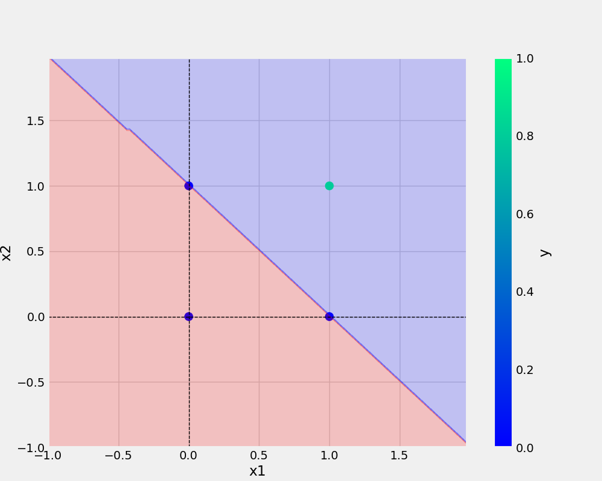

# oneNeuron
oneNeuron | perceptron


# commands used -

```bash
git add . && git commit -m "save_plot docstring updated" && git push origin main
```
# Add URL -
[Git Handbook](https://guides.github.com/introduction/git-handbook/)

<a href="https://www.w3schools.com">Visit W3Schools.com!</a>

# Add Image -



# Python Code -

```python
def main(data, eta, epochs, filename, plotFileName):
    df = pd.DataFrame(data)
    logging.info(f"This is the actual DataFrame \n{df}")
    X,y = prepare_data(df)

    model = Perceptron(eta=eta, epochs=epochs)
    model.fit(X,y)
    _ = model.total_loss() # dummy variable

    save_model(model,filename=filename)
    save_plot(df, plotFileName, model)
```